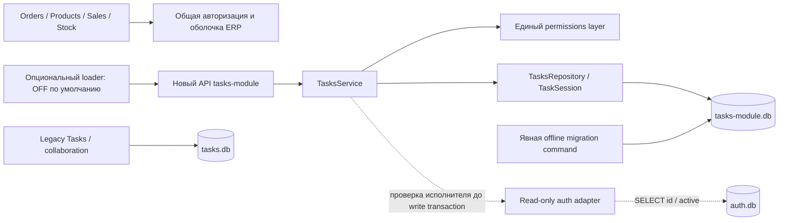

# Этап B — Core Task Domain + Permissions

Статус: `current` для ветки `codex/tasks-core-stage-b`, 2026-09-26.
Реализация выключена по умолчанию. Документ не подтверждает merge, push или deploy.

Ветка создана от принятого `6d06b8f34381665aed37deeacb643ae18ab12d49`.
Проверка `git merge-base --is-ancestor` подтвердила наличие
`a806ef287792524e730ff2074d3137eb7aee8664` в ancestry. SHA итогового commit
передаётся вместе с отчётом владельцу; проверенный исходный snapshot описан ниже.

## Результат и границы

Реализованы обычная задача, repository, service, единые права, локальная история,
оптимистическая блокировка, мягкое удаление и восстановление, HTTP API,
поиск, фильтры и summary. Новые задачи используют только `tasks-module.db`.
Флаг `ERP_TASKS_MODULE_ENABLED` по умолчанию `0`.

Новый модуль начинается с чистых данных. Перенос legacy задач, истории,
уведомлений, Inbox, повторений, task_links, старых полей и идентификаторов
не предусмотрен ни в этом этапе, ни как часть дальнейшей разработки нового
модуля. Mapping старых ID и совместимость старых ссылок не создаются.
`app/tasks` не читает `tasks.db` и не использует legacy бизнес-логику.
Legacy таблицы и данные не изменены. Их сохранение для ERP и возможное
отключение старого раздела — отдельное решение владельца.

UI, Projects, Microtasks, Inbox, Notifications, Comments, Checklist, Attachments,
Kanban и создание задач из ERP-сущностей не реализованы. Production Tasks
не переключён. Рабочая production `tasks-module.db` этим этапом не создавалась:
миграции и destructive scenarios запускались только на временных fixtures.

## Архитектура



ERP routes не обращаются к новому storage при обычном рендере. Обратной связи
от нового core к каталогу, складу, Orders, Products или общему audit journal нет.
`ATTACH` и `DETACH` дополнительно запрещены authorizer нового repository.

## Все изменённые файлы

| Файл | Изменение |
| --- | --- |
| `app/auth.py` | Узкий `AuthStore.get_active_user_identity`, только `mode=ro`, SELECT id/active |
| `app/tasks/__init__.py` | Описание независимого core, без действий при импорте |
| `app/tasks/domain.py` | Новые значения, backend validation, ошибки, календарная дата и часы |
| `app/tasks/permissions.py` | Все решения о правах и допустимых scopes |
| `app/tasks/repository.py` | Собственное storage, транзакции, CAS, выборки, summary, activity |
| `app/tasks/services.py` | CRUD, права, проверка исполнителя, completion, delete/restore, история |
| `app/tasks/routes.py` | Новый API namespace, CSRF, JSON, фильтры, paging |
| `app/tasks/error_boundary.py` | Предсказуемые domain errors и локальная обработка storage/internal failures |
| `app/tasks/migrations.py` | Offline schema v2, constraints, индексы, атомарный ledger |
| `app/tasks_boundary.py` | Инъекция read-only identity и CSRF adapters; fail-safe/OFF сохранены |
| `scripts/migrate_tasks_module.py` | Уточнение назначения существующей offline команды |
| `scripts/validate_tasks_runtime.py` | Stage B tests и Python-файлы добавлены в exact-runtime runner |
| `tests/test_tasks_core.py` | 31 тест domain, policy, transactions, concurrency, isolation, migrations |
| `tests/test_tasks_core_api.py` | 14 тестов HTTP, реального auth adapter и интеграции с Flask ERP |
| `tests/test_tasks_module.py` | Ожидание schema v2; проверки fail-safe сохранены |
| `tests/test_tasks_runtime_compat.py` | Проверки URI/CLI адаптированы к schema v2 |
| `docs/runtime-ddl-inventory.json` | SHA нового migration module для обязательного DDL gate |
| `docs/architecture/tasks-boundary.md` | Актуальная граница нового core и запрет legacy data migration |
| `docs/architecture/tasks-core-stage-b.md` | Этот отчёт и контракт этапа B |
| `docs/document-register.md` | Регистрация отчёта и результатов |
| `docs/validation/tasks-core-b-runtime.json` | Результат Linux / Python 3.6.8 / SQLite 3.7.17, включая SHA исходников |
| `docs/validation/tasks-core-b-ddl.json` | Результат runtime DDL gate на том же Linux runtime |

## Финальная schema v2

Все три таблицы находятся в новой `tasks-module.db`.
Точные SQL statements хранятся в `app/tasks/migrations.py`.

Таблица `tasks`:

| Поле | SQLite type / контракт |
| --- | --- |
| `id` | INTEGER PRIMARY KEY; новый независимый ID |
| `task_type` | TEXT NOT NULL DEFAULT normal; CHECK normal |
| `title` | TEXT NOT NULL; после trim 1–500 символов |
| `description` | TEXT NOT NULL DEFAULT пустая строка; максимум 50000 символов |
| `status` | TEXT NOT NULL DEFAULT new; new / in_progress / waiting / done |
| `priority` | TEXT NOT NULL DEFAULT normal; low / normal / high |
| `created_by` | INTEGER NOT NULL > 0; только серверная identity |
| `assigned_to` | INTEGER NOT NULL > 0; активность и существование проверяются до назначения |
| `deadline_date` | nullable TEXT YYYY-MM-DD; реальная календарная дата проверяется backend |
| `created_at` | TEXT NOT NULL; UTC ISO timestamp |
| `updated_at` | TEXT NOT NULL; UTC ISO timestamp |
| `completed_at` | nullable TEXT; заполнен тогда и только тогда, когда status=done |
| `version` | INTEGER NOT NULL DEFAULT 1; CHECK > 0 |
| `deleted_at` | nullable TEXT; UTC ISO timestamp soft delete |
| `related_entity_type` | nullable TEXT; backend limit 64 |
| `related_entity_id` | nullable TEXT; backend limit 200 |
| `related_entity_label` | nullable TEXT; backend limit 500 |

Ссылочные поля — только текстовые метаданные; никаких внешних запросов, FK в
ERP DB или построения связей из них нет. `assigned_to` при отсутствии в POST
равен автору; явный null не допускается. Автор и исполнитель не имеют FK в auth DB.

Таблица `task_activity`:

| Поле | Контракт |
| --- | --- |
| `id` | INTEGER PRIMARY KEY |
| `task_id` | INTEGER NOT NULL REFERENCES tasks(id), локальный FK |
| `actor` | INTEGER NOT NULL > 0 |
| `event_type` | TEXT NOT NULL с CHECK допустимых событий |
| `timestamp` | TEXT NOT NULL, UTC ISO timestamp |
| `task_version` | INTEGER NOT NULL > 0, версия задачи после изменения |
| `payload` | TEXT NOT NULL, JSON snapshot или before/after diff; без зависимости от JSON1 |

События: `created`, `content_changed`, `reassigned`, `deadline_changed`,
`priority_changed`, `status_changed`, `completed`, `reopened`,
`related_reference_changed`, `deleted`, `restored`.
При изменении нескольких групп полей одной операцией у событий общая task_version.

Таблица `tasks_module_migrations`: `version INTEGER PRIMARY KEY`,
`signature TEXT NOT NULL`, `applied_at TEXT NOT NULL`, `app_commit TEXT NOT NULL`.
Ledger содержит v1 `tasks-module-foundation-v1` и v2 `tasks-module-core-v2`.
v1 — ранее принятый пустой фундамент новой базы, не legacy schema.

Индексы:

```text
tasks_assignee_active       (assigned_to, deleted_at, deadline_date, id)
tasks_creator_active        (created_by, deleted_at, deadline_date, id)
tasks_active_deadline       (deleted_at, deadline_date, id)
task_activity_task_version  (task_id, task_version, id)
```

Миграция выполняет DDL по отдельным statements внутри `BEGIN IMMEDIATE`.
Ошибка откатывает DDL и ledger. Повторный запуск не меняет данные и файл базы.
Неизвестная schema не ремонтируется. Нет вызовов migration из HTTP/startup.

Административная команда для отдельно согласованного запуска:

```sh
python scripts/migrate_tasks_module.py --database /path/to/tasks-module.db --app-commit COMMIT
```

Эта команда создаёт пустое ядро либо обновляет собственный фундамент v1.
Она не принимает путь legacy storage и ничего из него не переносит.

## Permission matrix

Решения о ролях принимаются только в `app/tasks/permissions.py`.
Repository не получает пользователя или роль; scope ограничения уже разрешены
policy/service и включены в SQL до выдачи строк, total и summary.

| Действие | Admin | Creator | Assignee | Посторонний |
| --- | --- | --- | --- | --- |
| Создание от своего имени | да | да | да | любой активный пользователь от своего имени |
| Просмотр задачи и истории | да | да | да | нет, 404 |
| Title / description / deadline / priority | да | да | да | нет |
| Status / completion / reopen | да | да | да | нет |
| Reassign | да | да | нет | нет |
| Soft delete | да | да | нет | нет |
| Restore | да | да | нет | нет |
| Изменение будущих related_entity метаданных | да | да | нет | нет |
| scope=all | да | нет | нет | нет |

Creator=assignee получает права creator. Восстановление применимо к удалённой
задаче, остальные изменения — только к неудалённой. VIEW не подразумевает EDIT:
удалённая задача и её история остаются видимыми разрешённым участникам по ID,
но редактирование закрыто до restore. По умолчанию ни один список не включает
удалённые записи.

Отдельное уточнение политики: reserved `related_entity_*` считаются метаданными
управления, поэтому их изменение разрешено creator/admin. Это сознательное
ограничение сверх обычного рабочего содержимого, без интеграции с ERP.

IDOR: нет права VIEW → одинаковый `404 TASK_NOT_FOUND` для существующего и
несуществующего ID. VIEW есть, действие запрещено → `403 FORBIDDEN`.
Правила применяются также к истории, delete, restore, поиску и счётчикам.

## API

Prefix: `/api/v1/tasks-module`. Legacy `/api/v1/tasks` не изменён.

| Method | Path после prefix | Назначение |
| --- | --- | --- |
| GET | `/status` | Admin-only диагностика schema |
| GET | `/tasks` | Разрешённый список, total, limit, offset |
| POST | `/tasks` | Создание, 201 |
| GET | `/tasks/{id}` | Карточка, включая soft-deleted при наличии VIEW |
| PATCH | `/tasks/{id}` | Изменение полей с version |
| POST | `/tasks/{id}/status` | Только status и version |
| POST | `/tasks/{id}/delete` | Только version, soft delete |
| POST | `/tasks/{id}/restore` | Только version, восстановление |
| GET | `/tasks/{id}/activity` | История с limit/offset |
| GET | `/tasks/summary` | Total, new, in_progress, waiting, done, overdue, today |

Ответ успеха: `{"data": ...}`. Ошибки: `{"code": "...", "message": "..."}`,
при validation добавляется `fields`. Общий middleware ERP может добавлять
request_id к своим ошибкам. Нет traceback/SQL в ответах.

Коды: `AUTH_REQUIRED` 401; `CSRF_INVALID` / `FORBIDDEN` 403;
`TASK_NOT_FOUND` 404; `VERSION_CONFLICT` 409; `VALIDATION_ERROR` 422;
`USER_LOOKUP_UNAVAILABLE` / `TASKS_MODULE_UNAVAILABLE` 503.
Write API требует существующую авторизацию и `X-CSRF-Token`.
Клиентские id/created_by/timestamps/deleted_at и неизвестные поля отклоняются.

Scope: `my` по умолчанию (`assigned_to=current_user`), `created`
(`created_by=current_user`), `all` только admin. Team scope отсутствует.
Фильтры: status, priority, deadline_date, overdue, today, search.
Boolean query values: true/false/1/0. Search ищет буквальную подстроку
в title/description с Unicode casefold, включая кириллицу; `%` и `_`
экранируются. Данные передаются SQL параметрами.

Пагинация: limit=50, максимум 100; offset=0, максимум 1000000.
Сортировка: сначала ближайший deadline, затем задачи без срока; id разрешает
равенства. Summary считает весь разрешённый отфильтрованный набор, независимо
от limit/offset. История сортируется по id событий по возрастанию.

## Даты, version и транзакции

`deadline_date` — исходная календарная дата или NULL. Она никогда не превращается
в timestamp конца дня. Сегодня определяется московской бизнес-датой UTC+3,
независимо от TZ хоста. `overdue = deadline_date < today AND status != done`.
`today = deadline_date == today` включает выполненные задачи на эту дату;
статус можно дополнительно ограничить фильтром. Статуса overdue нет.

При входе в done заполняется completed_at. Редактирование других полей его
сохраняет. При выходе из done completed_at очищается. CHECK поддерживает
согласованность этих полей на уровне новой DB.

Создание:

```text
validate identity/payload → read-only active-assignee lookup → закрыть auth connection
BEGIN IMMEDIATE в tasks-module.db
INSERT task version=1
INSERT обязательной activity (и completed, если создана сразу done)
COMMIT; при любой ошибке ROLLBACK
```

Изменение, status, delete, restore:

```text
validate payload/version
при reassignment: предварительные VIEW/action/version → auth lookup вне транзакции
BEGIN IMMEDIATE в tasks-module.db
SELECT свежей task → VIEW → expected version → конкретное действие
UPDATE tasks SET ..., version=version+1 WHERE id=? AND version=?
проверить rowcount=1
INSERT всех обязательных activity событий
COMMIT; при любой ошибке ROLLBACK
```

Проверки прав и версии выполняются на свежей записи внутри той же write
транзакции, что и UPDATE. Дополнительный compare-and-swap защищает repository
от неверной ожидаемой версии. Два конкурентных обновления одной версии дают
один успех и один 409, без тихой потери изменений.

Повторная отправка уже установленных значений возвращает 422 без новой версии
и события. Пустой PATCH тоже отклоняется. Успешное реальное изменение всегда
увеличивает version ровно на один, независимо от количества событий history.

List/count выполняются в одном read snapshot; GET/history проверяют права внутри
read transaction. Соединения закрываются явно. Read использует URI mode=ro,
write — mode=rw; отсутствующая DB в request path не создаётся. Busy timeout
repository 250 ms, auth lookup 100 ms. WAL модуль не включает.

Soft delete — UPDATE deleted_at с version и событием deleted. Restore — обратный
UPDATE и событие restored. Физического DELETE в пользовательском API нет.

## Доказательства изоляции и важная граница auth

Тесты нового service запрещают открытие любого файла, кроме tasks-module.db.
Полный lifecycle нового API в реальном Flask ERP разрешает только эту базу и
auth.db; попытка открыть catalog, legacy tasks.db или другую ERP DB проваливает
тест. Эти проверки прошли. Ни общий audit journal, ни legacy TaskStore
для новых CRUD не вызываются. Related metadata не вызывает внешние запросы.

Auth adapter открывает auth.db через `mode=ro`, читает только id/active и
закрывает connection до начала Tasks write transaction. Отказ lookup оставляет
Task DB без изменений. Current user поступает через существующий `current_auth_user`.

Гарантия «Tasks не пишет в auth.db» относится к новому core и его adapter.
Существующий общий ERP session middleware по-прежнему обслуживает и продлевает
сессии в auth.db для HTTP-запросов. Его механика не менялась; ноль записей во всю
auth.db на полный HTTP request не заявляется. Это общая auth-инфраструктура,
не часть Task mutation и не участник её транзакции.

При OFF loader не импортирует новый module, не открывает storage и не запускает
миграции; новые routes не регистрируются. Если флаг выключен после регистрации,
error boundary закрывает их 503 без доступа к DB. Сбой импорта/регистрации,
неправильная или отсутствующая schema и отказ repository не останавливают ERP.

## Проверки

Windows / Python 3.12.14 / SQLite 3.53.1: 72 targeted tests, 0 failures/errors,
1 POSIX-only skip. Затем на фактическом Linux / Python 3.6.8 / SQLite 3.7.17:
**134 tests, 0 failures, 0 errors, 0 skips**, 19.005 s. В том числе 45 новых
Stage B tests и 89 проверок A/A.1 и совместимых legacy сценариев.

Runner: `scripts/validate_tasks_runtime.py`. Тестовая копия была создана из
Git tree `9e153aff35c025d823b7064b1a440158a7bf6889`, с LF; код компилировался и
исполнялся настоящим Python 3.6.8. Результат содержит SHA-256 26 Python-файлов,
которые сверены с индексом будущего commit. Последующие изменения — отчёт и
документация. Исторический отчёт A.1 не перезаписывался.

| Проверка | Результат |
| --- | --- |
| Создание, серверный created_by, active assignee | PASS |
| Матрица прав, creator=assignee, администратор | PASS |
| Direct ID, PATCH, status, delete, restore, activity IDOR | PASS |
| Scope/search/summary не раскрывают чужие задачи | PASS |
| Version increments, stale 409, конкурентные connections, CAS | PASS |
| Reassignment race: повторная проверка после user lookup | PASS |
| Completion/reopen, overdue/today, реальные даты, NULL deadline | PASS |
| Unicode search, буквальные wildcard, фильтры и paging | PASS |
| Delete исключает lists/search/summary, restore возвращает | PASS |
| Activity failure откатывает create и каждый вид mutation | PASS |
| Ошибка после первого history event откатывает все события | PASS |
| CRUD без legacy/catalog/складских DB и общего audit | PASS |
| Read-only auth adapter; lookup вне Tasks transaction | PASS |
| Реальное Flask ERP: auth, CSRF, оба API namespaces | PASS |
| OFF, import/registration errors, missing/corrupt schema, ERP routes | PASS |
| Нет migrations в startup/HTTP, idempotency, DDL rollback | PASS |
| Сохранность старых ERP entity assignments | PASS |
| Runtime DDL inventory / SQL compatibility gate | PASS |

Отдельный Linux процесс удерживал write locks на тестовых tasks.db и
tasks-module.db. Параллельные GET Orders и Products:

| Блокировка | Общее время двух requests | Открытий Tasks storage |
| --- | --- | --- |
| BEGIN IMMEDIATE | 0.142 s | 0 |
| BEGIN EXCLUSIVE | 0.131 s | 0 |

Это подтверждает отсутствие ожидания Tasks lock обычным рендером Orders/Products.
Badges падают локально, основной sidebar остаётся работоспособным. Также прошли
проверки Sales, Stock/Inventory и приходов из этапа A.

Python runtime: 3.6.8; SQLite: 3.7.17, source id
`2013-05-20 00:56:22 118a3b35693b134d56ebd780123b7fd6f1497668`.
Linux CentOS 7.9, kernel 3.10; Flask 2.0.3; Werkzeug 2.0.3; Jinja 3.0.3.
Подтверждены фактические URI ro/rw, percent encoding путей, PRAGMA, FK, CHECK,
indexes, transactions/rollback, row factory, authorizer, UDF casefold и SQL queries.
Современные SQLite UPSERT/RETURNING/JSON1, dataclasses и новый Python syntax
не используются.

Тесты выполнялись как UID 99 (nobody), в одноразовой `/tmp` копии, с пустым env,
отключённой сетью через namespace и Python guard. Все 3449 DB connections
относились к синтетическим fixtures; denied_paths пуст. Общий счётчик ATTACH=30
относится к legacy regression tests и отрицательной проверке запрета ATTACH;
новый CRUD не подключает другие DB. Реальные базы не блокировались и не портились.
После сохранения результатов временная серверная копия удалена. Сервис ERP
остался active, release остался `a0e53422c023bfaa8bdc40759b2f4587ea650d1c`.

Машинные отчёты:

- [Exact runtime result](../validation/tasks-core-b-runtime.json).
- [Runtime DDL gate](../validation/tasks-core-b-ddl.json).

## Ограничения и дальнейшая проверка перед отдельным deploy

- Политика без проектов и команд: видят автор, исполнитель, admin; Team scope нет.
- Search — ограниченный параметризованный substring scan, не полнотекстовый индекс.
  Нагрузочная проверка больших объёмов не выполнялась.
- Auth activity проверяется в момент lookup; атомарная связь с последующей
  деактивацией пользователя невозможна без общей транзакции, которая намеренно
  не вводилась. Ошибки lookup не повреждают Tasks DB.
- Ожидание длинной блокировки Tasks ограничено, но отдельный процесс для модуля
  не создавался: общие ресурсы Flask/хоста остаются общими.
- Семантика reserved reference fields, no-op PATCH и completed today явно описана
  выше. Нового интерфейса пока нет.
- Данные и schema legacy не переносились и не удалялись; отключение старого Tasks
  потребует отдельного согласования.

Перед будущим отдельно разрешённым deploy: проверить выбранный commit и флаг OFF;
на staging создать новую пустую tasks-module.db явной командой, повторить command
для idempotency, включить флаг только там и выполнить lifecycle/permissions smoke
на синтетических пользователях. Проверить валидную CSRF/session конфигурацию,
владельца и права каталога новой базы. На рабочем сервере ограничиться безопасными
GET Orders/Products/Sales/Stock/sidebar и проверкой OFF; destructive/lock scenarios
выполнять только в изолированных fixtures, как в этом отчёте.

Этап B завершает только backend core. Следующий функциональный этап требует
отдельного подтверждения владельца.
