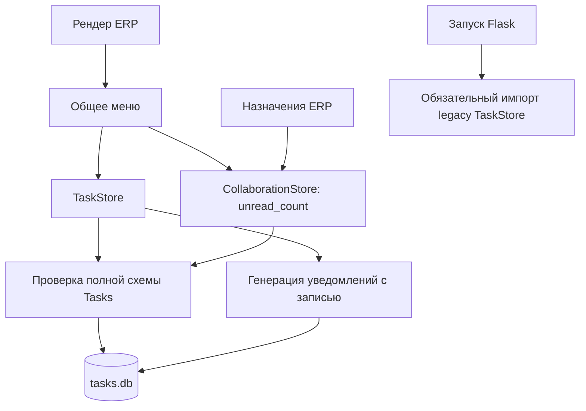

# Этап A — изоляция ERP от Tasks

Статус: `current` для ветки `codex/tasks-isolation-stage-a` от
`a0e53422c023bfaa8bdc40759b2f4587ea650d1c`, 2026-09-26.
Это отчёт о локальной реализации. Merge, push и deploy не выполнялись.

Дополнение A.1: ограничение проверки на современном Windows runtime закрыто
отдельным [exact-runtime validation](tasks-runtime-compatibility-a1.md).
Ниже сохранены результаты и ограничения именно первоначального этапа A.

## Результат и границы этапа

Обычный рендер Orders, Products, Sales, Receipts и Inventory не открывает
ни `tasks.db`, ни `tasks-module.db`. Sidebar формируется без TaskStore,
генерации уведомлений и CollaborationStore. Отказ счётчика не меняет страницу.

Создан пакет `app/tasks/` с repository, services, permissions, routes,
migrations и error boundary. Новый модуль по умолчанию выключен, существующие
`/app/tasks` и `/api/v1/tasks` не переключены. В новом модуле нет бизнес-операций:
только диагностический GET и отдельный offline bootstrap. UI, проекты,
микрозадачи, новый Inbox, комментарии, вложения и Kanban не реализованы.
Legacy-данные не переносились и не удалялись.

## Архитектура до и после

До:



После:

```mermaid
flowchart TD
  ERP[Рендер ERP] --> Menu[Меню без чтения Tasks]
  Menu --> HTML[Готовая страница]
  HTML -. после window.load .-> Badge[Отдельные badge GET]
  Badge --> RO[Только SELECT, короткие таймауты]
  RO --> Old[(legacy tasks.db)]
  Assign[Назначения ERP] --> Collab[Проверка только collaboration]
  Collab --> Old
  Startup[Запуск Flask] --> Switch{Новый Tasks включён?}
  Switch -->|нет| Core[ERP работает без импорта модуля]
  Switch -->|да| Loader[Регистрация внутри try/except]
  Loader -->|ошибка| Core
  Loader --> Routes[Изолированный /tasks-module/status]
  Routes --> Boundary[Проверка прав и error boundary]
  Boundary --> Repo[Read-only repository]
  Repo --> New[(tasks-module.db)]
  CLI[Явная offline-команда] --> Migration[Миграция только новой базы]
  Migration --> New
```

Схема не изображает оставшуюся общую авторизацию и штатные зависимости ERP
от собственных БД. Они не переносились в новый Tasks.

## Устранённые зависимости

1. Общий рендер ERP больше не создаёт TaskStore и не вызывает его schema validator.
2. Построение меню не генерирует task notifications и не пишет в `tasks.db`.
3. Меню не вызывает `CollaborationStore.unread_count`: его БД не требуется
   для отдачи страницы и не может удерживать её рендер SQLite-блокировкой.
4. Общие entity assignments не проверяют таблицы `tasks`, `task_links`,
   `task_history`, `task_notifications` и migration ledger Tasks.
5. Запуск Flask не требует успешного импорта legacy TaskStore или нового
   пакета Tasks. Ошибки optional registration логируются и остаются локальными.
6. Новая база не подключает catalog DB, Orders, Products или Stock и не
   участвует в их транзакциях. Bootstrap тоже использует только свой файл.

## Сознательно оставленные legacy-зависимости

- Legacy Tasks продолжает использовать `tasks.db` и прежнюю полную схему.
- В этой же базе остаются `entity_assignments`, `assignment_history` и
  `inbox_events`. Их нельзя удалять вместе со старыми задачами.
- Collaboration использует существующих пользователей ERP и прежнюю запись
  аудита через подключение каталога. Legacy-назначение задачи также сохраняет
  этот путь. У нового `app/tasks/` такого пути нет.
- Функции назначений, общий Inbox и явные фильтры «мои» клиентов, закупок,
  ремонтов всё ещё зависят от доступности collaboration-таблиц в `tasks.db`.
  Физическое повреждение этой legacy-базы может повредить именно эти функции;
  отделение их данных от базы в этап A не входит.
- Асинхронные счётчики читают legacy-данные: Tasks ещё не переключён.
- Генерация legacy task notifications сохранена в явном endpoint уведомлений
  Tasks. Посещение сторонней ERP-страницы больше её не запускает.
- Flask-процесс, авторизация и справочник пользователей общие. Отдельного
  процесса, второго входа и физической изоляции ресурсов ОС не вводилось.

## Настройки и база

| Настройка | По умолчанию | Поведение |
| --- | --- | --- |
| `ERP_TASKS_MODULE_ENABLED` / `TASKS_MODULE_ENABLED` | `0` | Выключенный модуль не импортируется и не регистрирует маршруты |
| `ERP_TASKS_MODULE_DATABASE` / `TASKS_MODULE_DATABASE` | `<project>/instance/tasks-module.db` | Repository принимает только файл с именем `tasks-module.db` |

При включении регистрируется только `GET /api/v1/tasks-module/status`.
Авторизация обязательна; диагностика разрешена admin. Успешный ответ:
`{"data":{"schema_version":1,"stage":"foundation"}}`.
Отсутствующая, повреждённая или неизвестная схема возвращает локальный 503;
неавторизованный пользователь — 401, другой сотрудник — 403 без открытия базы.
Если регистрация частично завершилась и выбросила exception, уже добавленные
views остаются закрытыми через состояние `registered=false`.

Миграция выполняется только явно:

```sh
python scripts/migrate_tasks_module.py --database instance/tasks-module.db --app-commit <commit>
```

В базе сейчас одна служебная таблица `tasks_module_migrations` с версией,
сигнатурой, временем и commit запуска. Команда идемпотентна; неизвестные
данные отвергаются без schema repair. Рендер, startup и Tasks HTTP не запускают
миграцию и не создают отсутствующий файл. Нет `ATTACH` к другим БД.

Локальная `instance/tasks-module.db` создана явной командой и проверена:
schema version 1. Файл исключён из Git штатными правилами; он не содержит
пользовательских задач. На production ничего не создавалось.
Новая база пока не добавлена в обязательный recovery/deploy contract:
модуль выключен и бизнес-данных нет. Перед будущим использованием для данных
нужно отдельно согласовать backup/restore и запуск миграций при выпуске.

## Счётчики sidebar

`GET /api/v1/tasks/badge` считает активные задачи текущего исполнителя,
требующие внимания сегодня или просроченные. `GET /api/v1/inbox/badge`
считает его непрочитанные входящие. Оба endpoint открывают legacy-базу
`mode=ro`, не валидируют полную схему и не генерируют уведомления.

SQLite busy timeout — 50 мс; progress handler прерывает длительный SELECT
с бюджетом около 100 мс. Браузер отменяет запрос через 1500 мс. Запросы
начинаются после `window.load`, по одному на вид счётчика для desktop и mobile.
Ошибка оставляет счётчик скрытым, без toast, перезагрузки или изменения меню.
Страницы сами не ожидают эти запросы. Это не абсолютный таймаут файловой системы.

## Проверки A–J

| Проверка | Реально выполненная проверка | Результат |
| --- | --- | --- |
| A | Нет `tasks-module.db`; настоящие ERP routes и шаблоны возвращают 200; файл не создаётся | PASS |
| B | Новая и legacy базы содержат не-SQLite байты; Products и остальные проверенные страницы возвращают 200 | PASS |
| C | TaskStore, repository и CollaborationStore принудительно выбрасывают exception; основные страницы не вызывают их | PASS |
| D | Настоящий запуск `app/web.py` при ошибке импортов Tasks; основные routes работают; отдельно проверена частичная регистрация Blueprint | PASS |
| E | Endpoint badge возвращает 503; ERP рендер работает. Node-тесты: HTTP/network/JSON error, abort, независимость другого счётчика | PASS |
| F | Реальные `BEGIN EXCLUSIVE` на обеих базах; основные страницы не пытаются их открыть. Legacy badge завершается 503 быстрее 1 с | PASS |
| G | Перехват `sqlite3.connect` запрещает оба Tasks-файла; обычный рендер Orders/Products и трёх других страниц делает ровно 0 попыток | PASS |
| H | Создание/изменение тестового товара, продажа со списанием 2→1 и сохранение заказа; 0 Tasks-подключений, новая БД побайтово неизменна | PASS |
| I | Bootstrap и диагностический GET под перехватом SQLite: открывается только новая БД; authorizer запрещает ATTACH; каталог не открывается | PASS |
| J | Временная legacy-база без четырёх таблиц задач: назначения order/customer/purchase/repair, история, Inbox и responsibility API работают | PASS |

Для A–G проверяются настоящие страницы `/app/orders`, `/app/products`,
`/app/sales`, `/app/receipts`, `/app/inventory` с авторизацией и настоящим
sidebar. Внешняя загрузка заказов подменена тестовой; все БД временные,
внешняя сеть отключена. H выполняет настоящий PATCH товара, POST продажи
и запись OrdersSnapshotStore, без вызовов реальных интеграций.

Набор backend-проверок: `test_tasks_isolation.py`, `test_tasks_module.py`,
`test_tasks.py`, `test_tasks_api.py`, `test_collaboration*.py`,
`test_navigation_preferences.py`, `test_orders_navigation_performance.py`,
`test_sidebar_visual_contract.py`, `test_user_notifications.py`.
Всего 80 тестов; отдельный Node-набор `tests/sidebar_badges.test.cjs` — 7 тестов.
Новый Node-набор включён в существующий frontend CI job.

Дополнительно: Python 3.6 grammar для 19 изменённых Python-файлов;
SQL compatibility gate (20 файлов, включая новую миграцию);
runtime DDL gate (20 контролируемых migration modules, новых runtime DDL нет);
`node --check`, JSON parsing и `git diff --check`.

## Ограничения проверки runtime

Локальная среда: Windows, Python 3.12.14, SQLite 3.53.1. Для backend использован
локальный однопроцессный адаптер проекта с `fcntl` shim; POSIX flock и работа
нескольких Linux workers этим запуском не проверены. SQLite-блокировки
`BEGIN EXCLUSIVE` настоящие, они не подменяются shim.

Точная связка Python 3.6.8 / SQLite 3.7.17 здесь не запускалась. Проверен
синтаксис Python 3.6 и статический запрет несовместимых SQL-возможностей;
это не подмена runtime-теста. Используемый `uri=True` есть в
[Python 3.6 sqlite3](https://docs.python.org/3.6/library/sqlite3.html),
URI и `mode=ro` поддерживаются [SQLite с 3.7.7](https://www.sqlite.org/uri.html).
Новых сторонних зависимостей нет. Linux CI и тесты на точном production runtime
остаются непроверенными до отдельного запуска; production в этом этапе не трогался.

## Полный список изменённых файлов

| Файл | Изменение |
| --- | --- |
| `app/web.py` | Убраны Tasks/collaboration из меню; ленивый legacy TaskStore; защищённые импорты и регистрация optional routes |
| `app/task_errors.py` | Чистые типы legacy-ошибок без импорта storage |
| `app/services/tasks.py` | Использует вынесенные типы ошибок; бизнес-логика сохранена |
| `app/collaboration_schema.py` | Read-only контракт трёх collaboration-таблиц и unique constraints |
| `app/services/collaboration.py` | Проверяет только собственную схему |
| `app/navigation_badges.py` | Отдельные авторизованные read-only badge endpoints |
| `app/templates/_sidebar.html` | Скрытые placeholders и загрузка счётчиков desktop/mobile |
| `app/static/js/sidebar-badges.js` | Отложенные независимые запросы, abort, локальная обработка ошибок |
| `app/static/css/sidebar.css` | Скрывает недоступные/нулевые счётчики через `[hidden]` |
| `app/tasks_boundary.py` | Выключенный по умолчанию модуль и fail-safe loader |
| `app/tasks/__init__.py` | Пакет без startup side effects |
| `app/tasks/repository.py` | Собственный файл, read-only статус, отсутствие repair |
| `app/tasks/services.py` | Минимальный сервис диагностики |
| `app/tasks/permissions.py` | Проверка существующей ERP-личности/admin |
| `app/tasks/routes.py` | Отдельный Blueprint и только диагностический GET |
| `app/tasks/error_boundary.py` | Локальный 503 и закрытие views при неуспешной регистрации |
| `app/tasks/migrations.py` | Явный транзакционный bootstrap собственной базы |
| `scripts/migrate_tasks_module.py` | Offline CLI без импорта Flask-приложения |
| `scripts/run_backend_tests.py` | Новый путь БД направлен во временную среду, флаг выключен |
| `app/schema_migrations.py` | Существующий SQL compatibility gate проверяет также новую миграцию |
| `docs/runtime-ddl-inventory.json` | Зарегистрирована offline-миграция и обновлены контрольные суммы |
| `tests/test_tasks_isolation.py` | Failure injection A–J на реальных ERP routes и операциях |
| `tests/test_tasks_module.py` | Switch, storage, права, частичная регистрация, SQL gate |
| `tests/sidebar_badges.test.cjs` | Ошибки/задержки badge, mobile/desktop, момент загрузки |
| `.github/workflows/tests.yml` | Запуск Node isolation-набора в CI |
| `docs/architecture/tasks-boundary.md` | Уточнены действующие и оставшиеся legacy-границы |
| `docs/architecture/tasks-isolation-stage-a.md` | Этот отчёт и инструкция проверки фундамента |
| `docs/document-register.md` | Зарегистрирован текущий контракт этапа A |

Локальные QA-адаптеры и логи находятся вне Git worktree, в `qa-reports/` рабочего
каталога. Они не изменяют production и не включаются в commit.

## Остановка после этапа A

Новый модуль выключен; переключения старых задач не было. После локального
commit работа останавливается для проверки владельцем. Следующий этап,
публикация, merge и deploy этим отчётом не разрешаются.
