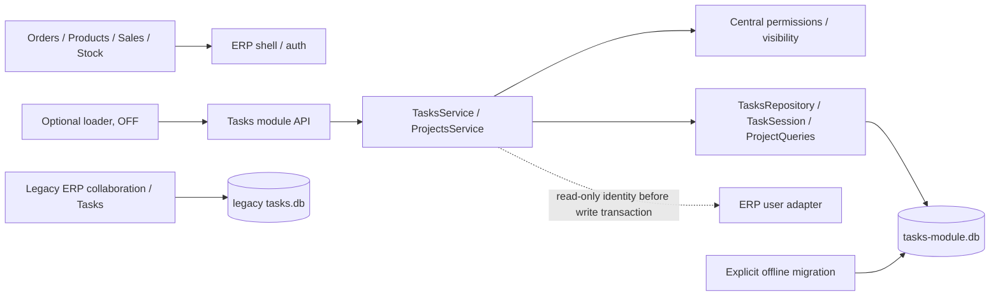

# Этап C — Projects, Team Visibility, Task Views

Статус: `current` для `codex/tasks-projects-stage-c`, 2026-09-26.
Base: `beb68e820572c223729671953f41a0cc203d15b3` (принятый B.2).
Флаг `ERP_TASKS_MODULE_ENABLED=0` остаётся значением по умолчанию.
Документ описывает код ветки, не подтверждает включение, push, merge или deploy.

## Границы и уточнения контракта

Добавлены только backend Projects/members, видимость Tasks, scopes/views,
счётчики и summary. Нет UI, Microtasks, Inbox, Notifications, Comments,
Checklist, Attachments, Kanban, ERP links или создания Tasks из ERP.
Legacy `tasks.db` не читается новым модулем, не изменяется и не мигрируется.
Миграция v2 → v3 относится исключительно к **новой** `tasks-module.db`.

В ходе согласования в чате «Задачи по ERP» уточнено:

- обычные списки исключают done; явный `status=done` или `view=archive` возвращает завершённые;
- `/tasks/summary` без параметров — персональный dashboard;
- summary с явным scope/filter сохраняет фильтрованную статистику B;
- архивный Project не принимает новые Tasks/перемещения внутрь, но существующая работа не замораживается;
- membership использует общую `project.version`;
- период архива определяется `completed_at` и бизнес-календарём UTC+3.

## Изменённые файлы

| Файл | Назначение изменения |
| --- | --- |
| `app/tasks/schema.py` | Frozen v2 contract, schema v3, Projects/members/history/FK/indexes |
| `app/tasks/migrations.py` | Явная атомарная offline migration v2 → v3 |
| `app/tasks/repository.py` | Validation v3, видимые Task queries, views, dashboard/filtered summary |
| `app/tasks/project_repository.py` | Локальные SQL Projects/members/activity/counters |
| `app/tasks/domain.py` | project_id, project name, filters, UTC+3 archive period |
| `app/tasks/permissions.py` | Единые Task/Project visibility predicates и Project management policy |
| `app/tasks/services.py` | Project access при создании/перемещении, history, summary dispatch |
| `app/tasks/project_services.py` | Project lifecycle, membership, concurrency и history |
| `app/tasks/routes.py` | Project API в существующем namespace |
| `scripts/validate_tasks_runtime.py` | Stage C в exact-runtime runner, hashes и query plans |
| `tests/test_tasks_projects.py` | Project/visibility/views/transactions/API/schema/runtime regressions |
| `tests/test_tasks_core.py` | Ожидания scopes, active lists и schema v3 |
| `tests/test_tasks_core_api.py` | API v3 и реальный ERP auth/CSRF/isolation lifecycle Projects |
| `tests/test_tasks_core_schema.py` | Corruption fixtures schema v3 |
| `tests/test_tasks_isolation.py` | Полный ledger v3 в corruption fixture |
| `tests/test_tasks_module.py` | Ожидание stage/schema v3 |
| `tests/test_tasks_runtime_compat.py` | Ожидание schema/ledger v3; проверки старого runtime сохранены |
| `docs/runtime-ddl-inventory.json` | SHA изменённых offline migration/schema modules |
| `docs/architecture/tasks-core-stage-b.md` | Ссылка на superseding Stage C contracts |
| `docs/architecture/tasks-projects-stage-c.md` | Этот отчёт |
| `docs/document-register.md` | Регистрация контракта C и validation artifacts |
| `docs/validation/tasks-projects-c-runtime.json` | Exact-runtime evidence и SHA проверенного кода |
| `docs/validation/tasks-projects-c-ddl.json` | DDL gate на Linux / Python 3.6.8 |

## Архитектура и schema v3

В новой базе шесть таблиц: `tasks_module_migrations`, `tasks`, `task_activity`,
`task_projects`, `task_project_members`, `task_project_activity`.
Полный DDL и метаданные проверки: `app/tasks/schema.py`.

| Таблица | Поля и существенные constraints |
| --- | --- |
| `task_projects` | `id INTEGER PRIMARY KEY`; `name TEXT NOT NULL`, trim length 1..200; `owner_id INTEGER NOT NULL CHECK >0`; `created_at`, `updated_at TEXT NOT NULL`; `archived_at TEXT NULL`; `version INTEGER NOT NULL DEFAULT 1 CHECK >0` |
| `task_project_members` | `project_id INTEGER NOT NULL REFERENCES task_projects(id)`; `user_id INTEGER NOT NULL CHECK >0`; `created_at TEXT NOT NULL`; composite PK `(project_id,user_id)` |
| `task_project_activity` | `id INTEGER PRIMARY KEY`; `project_id INTEGER NOT NULL REFERENCES task_projects(id)`; `actor INTEGER NOT NULL CHECK >0`; `event_type TEXT NOT NULL CHECK` enumeration; `timestamp TEXT NOT NULL`; `project_version INTEGER NOT NULL CHECK >0`; `payload TEXT NOT NULL` JSON |
| `tasks` | Полный contract B сохранён; добавлен nullable `project_id INTEGER REFERENCES task_projects(id)` |
| `task_activity` | Полный contract B сохранён; к event_type добавлен `project_changed` |
| `tasks_module_migrations` | Ledger v1 foundation, v2 core, v3 `tasks-module-projects-v3` |

Project events: `created`, `renamed`, `archived`, `restored`, `member_added`,
`member_removed`. Project owner implicit: отдельной membership-строки нет,
добавление/удаление owner как member отклоняется. Перенос владения не добавлен.
FK только внутри новой базы, без cascade delete и FK к auth/ERP.

Validation проверяет типы, NULL/default/PK, tokenized CREATE TABLE с CHECK,
FK, ledger и ожидаемые indexes. Несоответствие вызывает локальный отказ,
не schema repair. Миграции из HTTP/startup не запускаются.

Offline v2→v3: `BEGIN IMMEDIATE`, проверка frozen v2, локальные TEMP copies,
удаление дочерней `task_activity`, затем `tasks`, создание v3, восстановление
**собственных v2** records/history, ledger v3, validation, COMMIT.
`foreign_keys=ON` всё время; нет ATTACH, writable_schema и rename assumptions.
Ошибка DDL/history/FK откатывает весь переход; тест сравнивает файл v2 побайтно.

## Permissions

| Действие | Admin | Project owner | Project member | Посторонний |
| --- | --- | --- | --- | --- |
| Создать Project от своего имени | да | любой активный user | любой активный user | любой активный user |
| Просмотр Project/members/activity/counters | все | свой | доступный | 404 |
| Rename/archive/restore Project | да | да | нет, 403 | 404 |
| Add/remove member | да | да | нет, 403 | 404 |
| Создать Task в активном Project | да | да | да | 404 |
| Просмотр Task в Project | да | да | да | только если creator/assignee |
| Изменить Task | по B | только если creator/assignee | только если creator/assignee | по личным правам B |

Для Task VIEW: admin OR creator OR assignee OR owner/member её Project.
Без Project: только admin/creator/assignee. Политика одинакова для GET, history,
list/search, archive, summary/count. Project list сначала фильтрует доступные
Projects; все их Tasks видимы, поэтому counters не раскрывают чужие данные.
Project GET и Task GET используют те же SQL visibility predicates, что списки.

Task mutation policy B сохранена: admin/creator редактируют, меняют статус,
переназначают, удаляют и восстанавливают; assignee редактирует рабочее содержимое
и статус, но не reassign/delete/restore. Членство даёт VIEW, не EDIT.
Перемещение требует права редактирования Task и доступа к целевому активному
Project. В NULL перемещать можно по Task permissions.
Удаление member немедленно убирает project-доступ; личные права creator/assignee
сохраняются. Ошибки direct ID без VIEW согласованно возвращают 404.

## Scopes и views

Все обычные выборки исключают `deleted_at IS NOT NULL`.

| Параметр | Точное определение |
| --- | --- |
| `scope=my` (default list) | assigned_to=current_user |
| `scope=created` | created_by=current_user |
| `scope=team` | creator OR assignee OR доступные Projects; admin — все |
| `scope=all` | union всего видимого; сейчас совпадает с team, без bypass |
| `view=delegated_waiting` | created_by=current AND assigned_to!=current AND status!=done; без scope list использует created |
| `view=today` | deadline_date=ERP business date UTC+3 AND status!=done |
| `view=overdue` | deadline_date<ERP business date UTC+3 AND status!=done |
| `view=archive` | status=done; soft-deleted не входят |

Scope и view пересекаются. `status=waiting` — статус работы, не managerial view.
Обычный list дополнительно исключает done, если не переданы `status` или archive.
`today=true/false`, `overdue=true/false` B остаются фильтрами вычисляемых значений.
NULL deadline не Today/Overdue. Единая функция business_today использует UTC+3.

Archive поддерживает `search`, `project_id`, `project=none`, `assigned_to`,
`created_by`, `date_from`, `date_to`; даты YYYY-MM-DD, обе пользовательские границы
включительные. В SQL — completed_at в UTC интервале `[from, to+1day)`.
Период разрешён только с `view=archive`; некорректный/перевёрнутый/непредставимый
диапазон возвращает 422. При reopen completed_at очищается; повторное завершение
создаёт новое completed_at, поэтому Archive period отражает последнее завершение.

## API

Общий prefix: `/api/v1/tasks-module`.

| Method | Path | Payload / query |
| --- | --- | --- |
| GET | `/projects` | archived=false (default)/true, search, limit, offset |
| POST | `/projects` | name; owner определяется сервером |
| GET | `/projects/{id}` | видимый Project |
| PATCH | `/projects/{id}` | name, version |
| POST | `/projects/{id}/archive` | version |
| POST | `/projects/{id}/restore` | version |
| GET | `/projects/{id}/members` | limit, offset; owner_id отдельно, version и total members |
| POST | `/projects/{id}/members` | user_id, version |
| DELETE | `/projects/{id}/members/{user_id}` | JSON version |
| GET | `/projects/{id}/summary` | open, in_progress, overdue |
| GET | `/projects/{id}/activity` | limit, offset |

Существующие `/tasks`, `/tasks/{id}`, `/status`, `/delete`, `/restore`, `/activity`,
`/tasks/summary` сохранены. POST/PATCH Task теперь принимают project_id/null.
GET `/tasks` расширен перечисленными scopes/views/filters. Пагинация: default 50,
maximum 100, offset до 1000000. Дубли query-параметров отклоняются как раньше.
Ошибки/CSRF/body cache/MAX_CONTENT_LENGTH используют boundary B.1/B.2.

Project archive меняет только Project archived_at/version/history. Не меняет
Task statuses, Task versions, deleted_at или историю Tasks. Существующие Tasks
остаются видимыми и редактируемыми; можно завершать и перемещать наружу.
POST новой Task / фактическое перемещение в archived Project возвращает 422.
Повтор unchanged project_id в обычном PATCH не считается перемещением.

## Summary и counters

`GET /tasks/summary` **без scope/filters** (limit/offset не меняют режим):

- in_progress: assigned_to=current, status=in_progress;
- today/overdue: назначенные текущему пользователю активные Tasks;
- delegated_waiting: созданные текущим пользователем другим, status!=done;
- inbox=null;
- compatibility fields total/new/waiting/done: личные assigned Tasks, total включает done.

Две агрегатные выборки в одном read snapshot. Даже admin получает персональный
dashboard. Для командной статистики он явно запрашивает scope=all/team.

При **явном scope/filter** summary использует filtered semantics B:
применяет scope/filters (default scope=my), затем считает все показатели этой
выборки. Total/done могут включать завершённые, если не применён активный view.
`delegated_waiting` тоже ограничен этой выборкой, поэтому для scope=my равен нулю.
Pagination limit/offset валидируются, но не меняют режим или агрегаты summary.
Неизвестные параметры — 422, не переключение на dashboard.

Project counters: open=status!=done; in_progress=status=in_progress;
overdue=deadline_date<business_today AND status!=done. Все исключают soft-delete.
Project list возвращает эти три counters; отдельный summary имеет те же условия.

## Транзакции и concurrency

Каждая mutation: `BEGIN IMMEDIATE` → свежие права/version → Task/Project/member
изменение → обязательная local activity → COMMIT. При ошибке ROLLBACK целиком.
Reassign/user lookup выполняется через read-only adapter **до** write transaction,
после чего права/version перепроверяются. Других DB внутри business transaction нет.

Task CAS `UPDATE ... WHERE id=? AND version=?`, `version=version+1`; project CAS
аналогичный. Все rename/archive/restore/member changes требуют current version.
Конкурирующие изменения с одной версией дают один success и один 409.
Membership + project bump + ProjectActivity атомарны, version увеличивается один раз.
Duplicate add / отсутствующий remove / повтор archive/restore → 422 без history/bump;
если версия уже устарела — сначала 409. Task delete/restore семантика B сохранена.

## Queries, indexes и performance

Новые indexes: owner/archived/id Projects; user/project membership; project/deleted/
status/deadline/id Tasks; deleted/status/completed/id Tasks; project/id history.
Список Projects делает ровно **два business SQL queries** для 1 и 20 проектов:
COUNT accessible Projects и paginated derived table LEFT JOIN Tasks с агрегатами.
Schema validation имеет отдельное фиксированное число запросов, N+1 нет.

EXPLAIN QUERY PLAN на SQLite 3.7.17 подтверждает indexed membership lookup через
composite PK и Tasks join через `tasks_project_active`. GROUP BY использует TEMP
B-TREE; visibility OR/EXISTS может сканировать Projects. Это не нагрузочный benchmark.
TD-TASKS-001 (старые sorting/COALESCE/activity ordering) сознательно отложен до
performance acceptance, индексы старых запросов ради него не перестраивались.

## Проверки

Relevant suite включает новый module/core/projects, legacy Tasks/collaboration,
navigation/sidebar/Orders performance/user notifications и runtime compatibility.

- Windows Python 3.12.14 / SQLite 3.53.1: 208 tests, 207 passed + 1 Linux-only skip.
- Linux CentOS 7.9 / Python 3.6.8 / SQLite 3.7.17 / Flask 2.0.3 / Werkzeug 2.0.3:
  208 tests, 208 passed, 0 skips/errors/failures.
- Все 31 source hashes exact-runtime runner совпадают с каноническими LF source.
- DDL gate: PASS, SQL compatibility: 21 source files.
- Fixtures — временные DB, UID 99, env очищено, OS network namespace отключён.
  Database guard не разрешил ни одного пути за пределами fixtures; production DB
  не открывались. Legacy tests открывают свои synthetic legacy fixtures; это не
  обращения нового Tasks core к legacy storage.

Проверены permissions/IDOR/search/summary/counters, UTC+3 midnight, Archive period,
soft-delete, archived Project guard, deterministic membership interleavings,
Activity rollback, v2→v3 rollback/idempotency/schema corruption, HTTP lifecycle
с реальным ERP auth/CSRF, OFF и fail-safe, Orders/Products без Tasks storage/lock wait.
Machine-readable evidence: `docs/validation/tasks-projects-c-runtime.json` и
`tasks-projects-c-ddl.json`.

## Независимый review и завершение

В [чате «Задачи по ERP»](https://chatgpt.com/g/g-p-6aa80e13ea2881919639c9b041fc3174-erp-bitriks/c/6ab7c9f4-ef24-83ed-b0ca-ff67bd5f9b0d)
переданы полные исходники и diff к B.2. Первый code review: PASS WITH ISSUES,
одно MEDIUM по выбору summary-режима из-за limit/offset. Исправлено, добавлен HTTP
regression; малый delta и финальный exact-runtime JSON переданы повторно.
Итоговый verdict ревьюера: **FINAL VERDICT STAGE C: PASS**.
Ревьюер анализировал предоставленный код/evidence; тесты запускал Codex.

После выгрузки evidence временный `/tmp/erp-tasks-c.iUtArx4B` удалён с проверкой
его resolved path. Read-only проверка production: прежний commit
`a0e53422c023bfaa8bdc40759b2f4587ea650d1c`, `clock-erp` active. Restart, изменение
настроек и рабочих БД не выполнялись. Итоговый commit SHA сообщается с отчётом.

## Ограничения и эксплуатация

Функциональной классификации «Программист/Маркетинг/Контент/Склад» в узком identity
adapter нет. ERP имеет system roles admin/employee и legacy team labels
owner/admin/manager/warehouse/viewer; это не независимая HR-классификация.
Новая система ролей и функциональные фильтры не добавлены.

Team/all пока совпадают; Project owner immutable; membership без дополнительных
ролей. Удаление Project API не предусмотрено. Runtime validation доказывает
совместимость на synthetic fixtures, но не заменяет будущую нагрузочную проверку.
Новая рабочая DB и production module этим этапом не создаются/не включаются.
Перед отдельным будущим deploy нужны backup новой DB, offline migration и safe
smoke OFF/Orders/Products/Tasks; destructive tests остаются только на fixtures.
